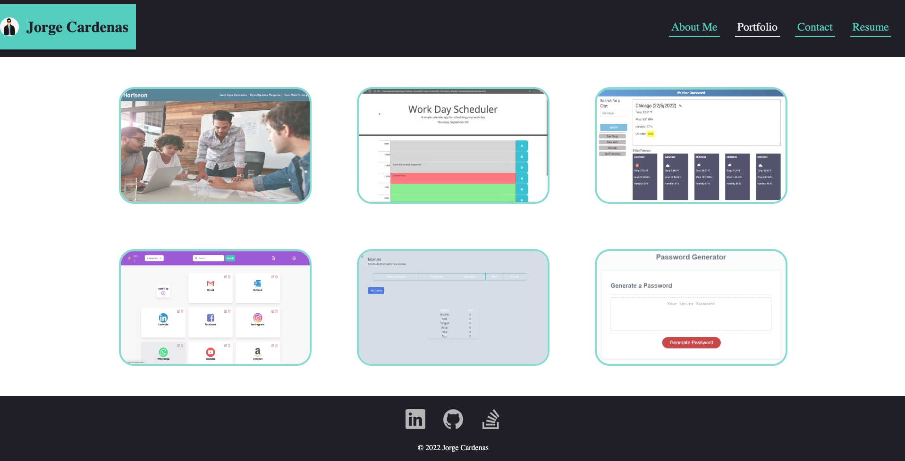
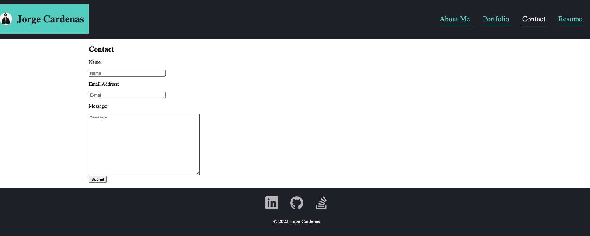
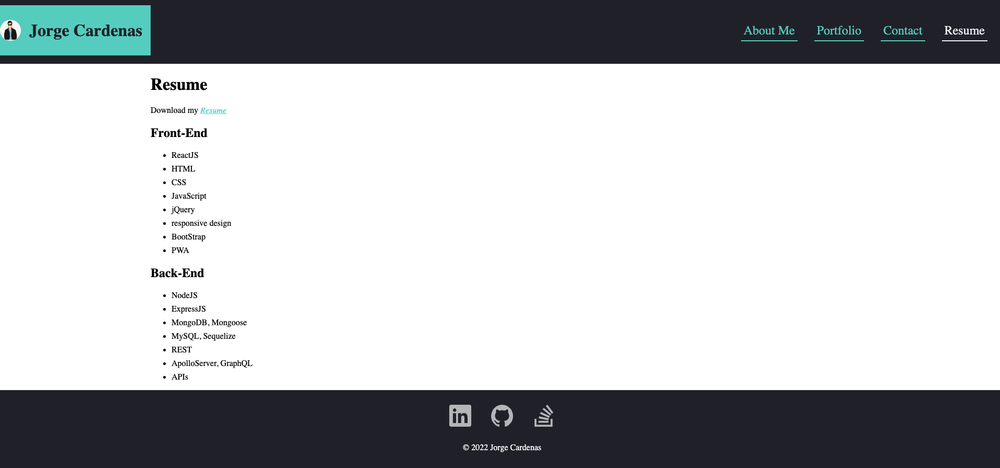

# REACT Cardenas Portfolio

### 
## Description

This is my Portfolio where you will be able to see all the most important projects I have been worked with.

Cardenas portfolio has been built with help of the following:

* 
* 
* 
* 

You will find the following projects added to my Portfolio:

* Day Planner
* Horiseon
* Weather Dashboard
* Wolfinance
* Pin It
* Password Generator

In my portfolio as you can see below, it is structured with a header with my name and a nav section with links that follows you to  little story about me, my portfolio, a contact form and my Resume where you will be able to see my expirience and my actual job.

You can access to my GitHub, LinkedIn and Stackoverflow account by clickcing in the icons below at the footer.

The website was design with help of media queries to be able to adapt to any screen size.

### MIT License (https://opensource.org/licenses/MIT)

      MIT License Copyright (c) [year] [fullname]
      
      Permission is hereby granted, free of charge, to any person obtaining a copy
      of this software and associated documentation files (the "Software"), to deal
      in the Software without restriction, including without limitation the rights
      to use, copy, modify, merge, publish, distribute, sublicense, and/or sell
      copies of the Software, and to permit persons to whom the Software is
      furnished to do so, subject to the following conditions:
      
      The above copyright notice and this permission notice shall be included in all
      copies or substantial portions of the Software.
      
      THE SOFTWARE IS PROVIDED "AS IS", WITHOUT WARRANTY OF ANY KIND, EXPRESS OR
      IMPLIED, INCLUDING BUT NOT LIMITED TO THE WARRANTIES OF MERCHANTABILITY,
      FITNESS FOR A PARTICULAR PURPOSE AND NONINFRINGEMENT. IN NO EVENT SHALL THE
      AUTHORS OR COPYRIGHT HOLDERS BE LIABLE FOR ANY CLAIM, DAMAGES OR OTHER
      LIABILITY, WHETHER IN AN ACTION OF CONTRACT, TORT OR OTHERWISE, ARISING FROM,
      OUT OF OR IN CONNECTION WITH THE SOFTWARE OR THE USE OR OTHER DEALINGS IN THE
      SOFTWARE.

## Contribution

Jorge Cardenas

## Website Presentation

The images below show how the website it´s deployed.

## Link to deploy application

https://jorgecdl96.github.io/React-Portfolio/

